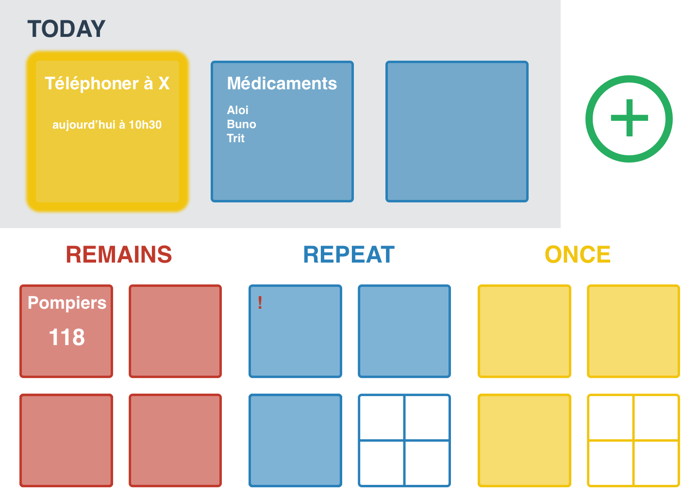
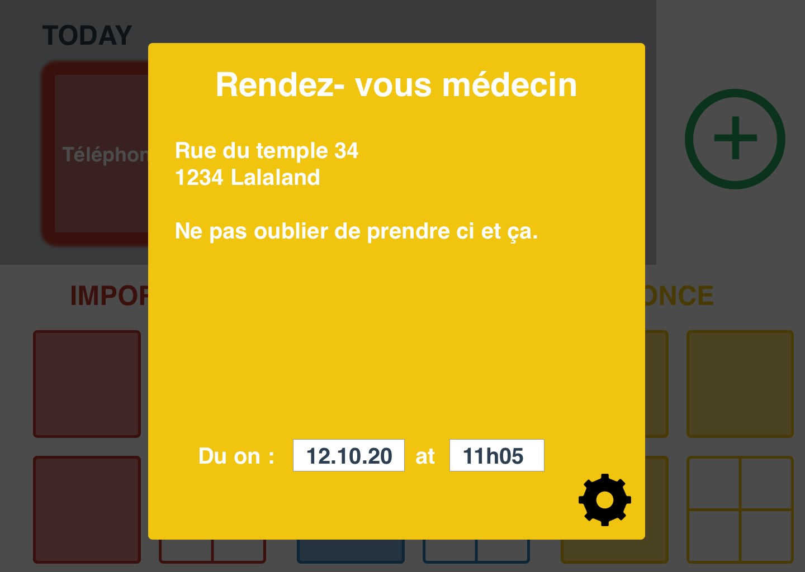
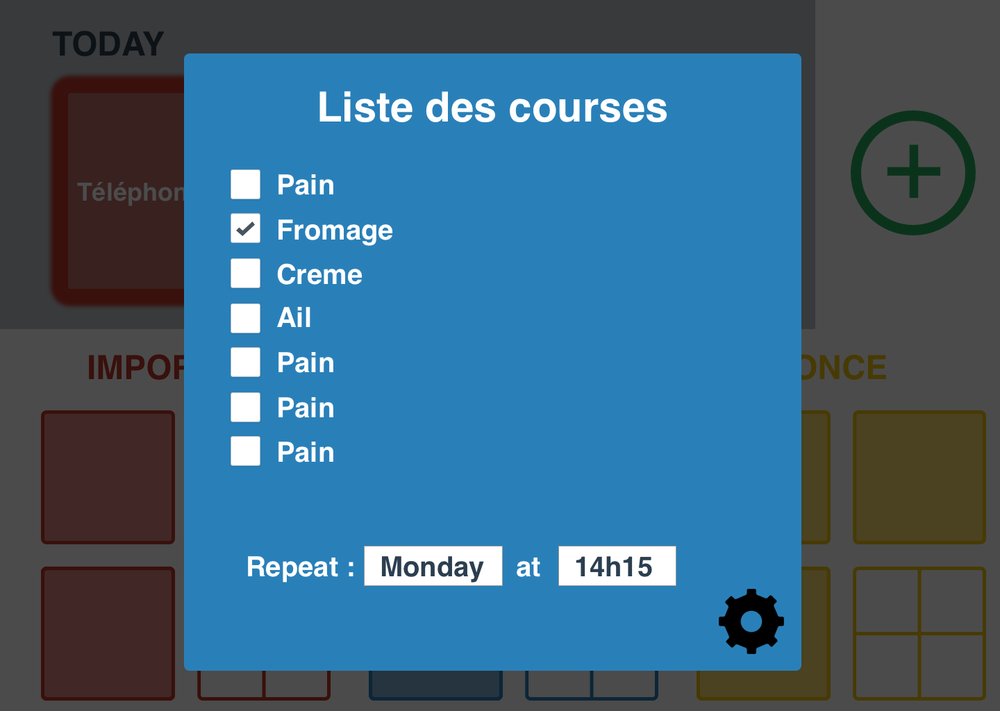
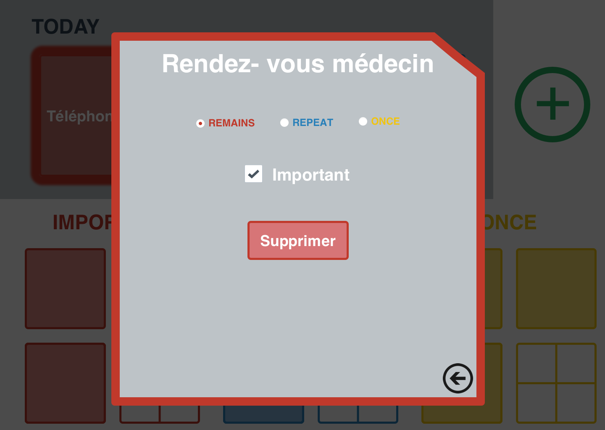
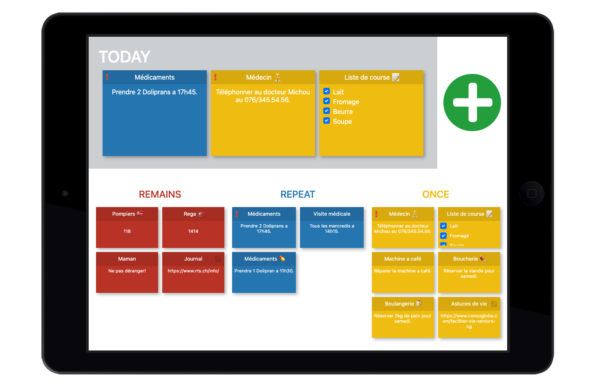
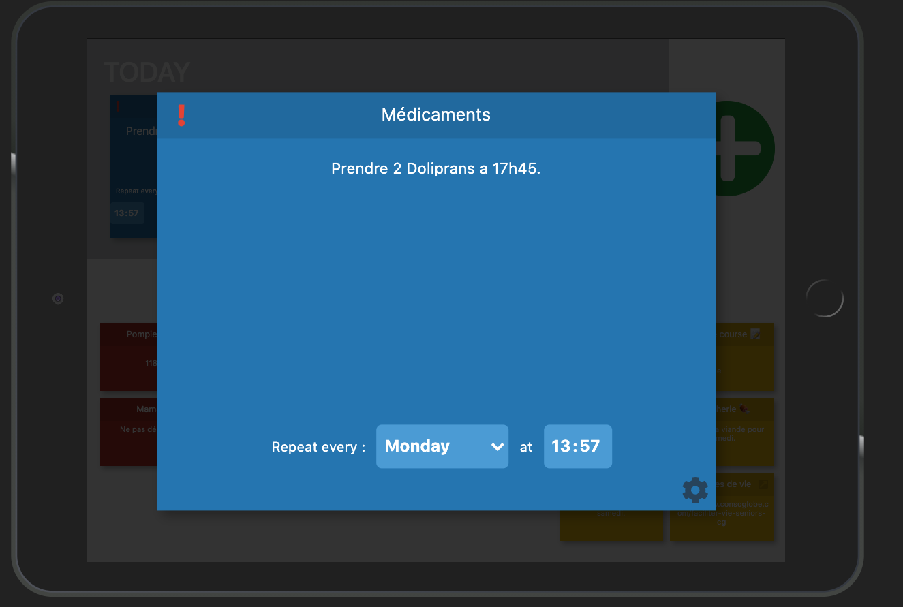
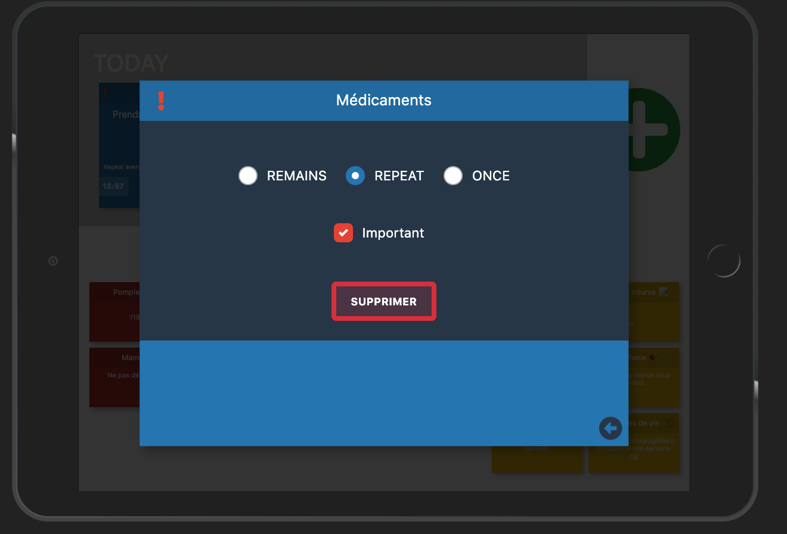

# IHM - Projet

###### Thierry Otto & Thibaud Alt

## 1. Analyse

Pour que l'interface soit la plus simple possible, nous l'avons imaginé sur une page unique et divisée en 4 zones d’affichages simples :

1. **En haut à gauche** : Les « hot post-it », il s'agit de post-it mis en avant à un certain moment en fonction de l’échéance ou de l’importance.

2. **En haut à droite** : Un bouton d'ajout de post-it

3. **En bas à gauche** : les post-it toujours affichés, il peut y'en avoir jusqu'a 4

4. **En bas à droite** : les post-it unique et répétitifs, pour ceux-ci 3 sont affichés directement, les suivants sont disponnible en appuyant sur le dossier.

Les post-it important apparaissent avant les autres post-it.

Par soucis de simplicitée il y a uniquement deux actions possibles sur cette interface :

- Afficher un post-it en cliquant dessus
- Ajout d’un post-il en cliquant sur le boutton "+"

### New post-it

Lors d'un clic sur le bouton d'ajout de post-it, on peut choisir entre les 3 types de post-it disponnibles.

Un nouveau post-it vierge est alors créé, l'interface de celui-ci est identique à celle du point suivant.

### View / edit post-it

Lors d'un clic sur un post-it, celui-ci s'ouvre en grand. On peut alors directement modifier les donnes affichées (titre, texte, date). Le champ titre est le seul champ obligatoire.

Les types de post-it proposés sont les suivants :

- Simple texte avec Emoji

- Liste de tâches partielles

Dans cette vue il est possible de cliquer sur la roue de réglage. A ce moment la le post-it tourne et les réglages de celui-ci s'affichent.

### Post-it settings

Les configurations possibles possible d’un post-it sont :

- Le changement de type (remains, repeat, once)
- Le marquage comme "important"

Nous avons décidé de fixer les couleurs pour éviter des confusions et d’avoir un arc-en-ciel au niveau de l’interface.

C'est également dans cette vue que l'on peut supprimer un post-it.

### Fonctionnalité suplémentaire

Comme fonctionnalité supplémentaire par rapport aux spécifications de base, nous avons imaginé un type de post-it supplémentaire. Celui-ci propose d'ajouter une URL à la place de son texte. 

Au clic sur ce post-it, l'url spécifiée est directement ouvert dans le navigateur web et affiche par exemple un journal ou une autre application web. Pour les personnes âgées, cela nous semble un moyen simple et efficace de leur créer des raccourcis vers leurs sites préférés.

## Technologie

Nous avons choisi d'utiliser les frameworks [React.js](

://fr.reactjs.org/) et [Bootstrap](https://getbootstrap.com/) afin de réaliser cette interface web. Celle-ci sera alors disponible tant sur un ordinateur que sur une tablette.
La persistance des données sera fait dans une base de données type [MySQL](https://www.mysql.com/fr/) ou [SQLLite](https://www.sqlite.org/index.html).
Une fois terminée, notre application ser déployé sur un serveur web de type [Netlify](https://www.netlify.com/) puis sera accessible via tout navigateur moderne.

## 2. Développement

### Environement (React.js)

In the project directory, you can run:

### `npm start`

Runs the app in the development mode.  
Open [http://localhost:3000](http://localhost:3000) to view it in the browser.

The page will reload if you make edits.  
You will also see any lint errors in the console.

### `npm test`

Launches the test runner in the interactive watch mode.  
See the section about [running tests](https://facebook.github.io/create-react-app/docs/running-tests) for more information.

### `npm run build`

Builds the app for production to the `build` folder.  
It correctly bundles React in production mode and optimizes the build for the best performance.

The build is minified and the filenames include the hashes.  
Your app is ready to be deployed!

See the section about [deployment](https://facebook.github.io/create-react-app/docs/deployment) for more information.

### Inspirations

Pour réaliser la partie technique de ce projet, nous nous sommes inspirés des projets existants suivants.

- [https://github.com/ajainvivek/react-stickies](https://github.com/ajainvivek/react-stickies)
- [https://github.com/cosmicjs/sticky-notes](https://github.com/cosmicjs/sticky-notes)
- [https://github.com/gemmi-arts/react-sticky-notes](https://github.com/gemmi-arts/react-sticky-notes)
- [https://github.com/jeffsdev/React-StickyNotes](https://github.com/jeffsdev/React-StickyNotes)

## 3. Résultat

Après de multiples heures de développement, de placement et de stylisation, nous avons pu réaliser l'interface suivante. Celle-ci est actuellement adapté pour un iPad en mode paysage.

Nous avons tout fait pour garder l'interface la plus claire et la plus simple d'utilisation possible.

#### Home

La première page de l'application se compose de tous les post-its triés automatiquement par catégories sur la partie basse de l'écran.  Sur la partie haute, l'on retrouve les post-its actuellement mis en avant un le bouton d'ajout de post-it.

Les post-its noté comme importants sont marqués d'un point d'exclamation à gauche de leur titre. Les post-its de type "liens" sont quant à eux identifiés par un discret icone de lien à droite de leur titre.

Lors du développement de l'application, nous avons quelques peu modifié notre interface notamment les points suivants

- Sur la page principale, nous avons pu afficher 6 post-its par catégorie au lieu des 4 prévus initialement.

- Nous avons décidé de remplacer les "dossiers de posts-its" par un simple défilement verticale qui nous semble plus cohérent.

Nous sommes content de cette interface que nous avons réussis à rendre clair et intuitive. De plus la possibilité d'ajout d'emoji rend l'expérience plus sympatique.

#### Modification

Au clic sur un post-it, celui-ci s'ouvre en plein écran. Cela permet de le voir clairement et de le modifier au besoin.

Un selecteur de jour et d'heure est disponnible pour les post-its de type "repeat". Un selecteur de date et d'heure est disponnible pour les post-its de type "once".

#### Paramètres

Lors d'un clic sur la roue de réglage en bas à droite, on accède au réglages du post-it. Ici encore nous avons voulu créer une interface simple et facile d'utilisation.

Il es tpossible de changer le type de post-it, celui-ci changera alors de couleur et sera replacé sur la page principal. On peut marquer le post-it comme "important". Il est possible via le bouton rouge de supprimer ce post-it. 

#### Post-it "liens"

Nous avons créé des post-its spéciaux permettant de sauvegarder des liens. Dès qu'un post-it contient une adresse web, un clic sur celui-ci ouvre directement le site web associé. 

Pour en modifier le contenu, il alors possible de cliquer sur la roue de réglage en bas à droite, le comportement de modification est alors identique à tout autre post-it. La roue de réglage disparait automatiquement après 10 secondes.

#### Rotation

Nous avons implémenté un système détectant l'orientation du dispositif, celui-ci force l'utilisateur à utiliser notre application en mode paysage. Si l'utilisateur tourne son iPad en mode portrait, l'écran suivant est affiché.

### Améliorations possibles

- Création d'un algorithme de choix des post-its "today" 
- Placement des post-its lors de modifications de type
- Prise en charge de différentes tailles d'écran 
- Résolutions de bugs

## 4. Démo

Nous avons publié une version démo de l'application sur Netlify, celle ci est disponnible à l'adresse suivante : [romantic-sammet-61761f.netlify.app](https://romantic-sammet-61761f.netlify.app/). 

Attention, cette version est uniquement adapté au format tablette, elle a été testé avec un iPad de 1024 x 768px. Il se peut que sur d'autre tailles d'écrans, l'affichage ne soit pas optimal.
