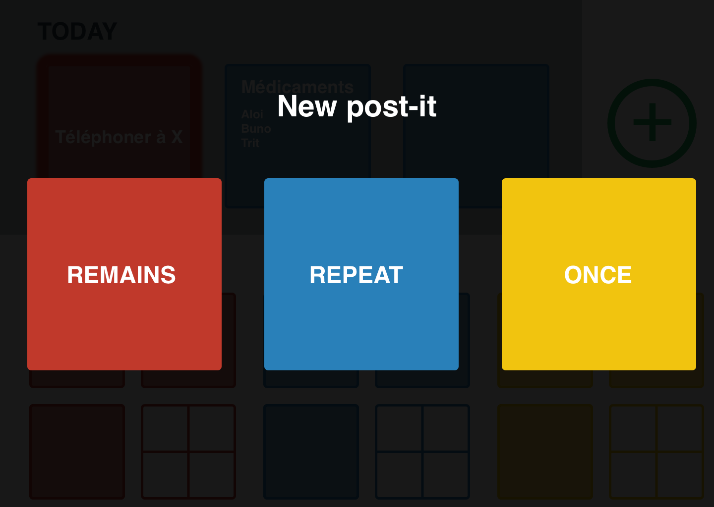

# IHM - Projet

###### Thierry Otto & Thibaud Alt

## Interface

Pour que l'interface soit la plus simple possible, nous l'avons imaginé sur une page unique et divisée en 4 zones d’affichages simples :

1. **En haut à gauche** : Les « hot post-it », il s'agit de post-it mis en avant à un certain moment en fonction de l’échéance ou de l’importance.

2. **En haut à droite** : Un bouton d'ajout de post-it

3. **En bas à gauche** : les post-it toujours affichés, il peut y'en avoir jusqu'a 4

4. **En bas à droite** : les post-it unique et répétitifs, pour ceux-ci 3 sont affichés directement, les suivants sont disponnible en appuyant sur le dossier.

Les post-it important apparaissent avant les autres post-it.

Par soucis de simplicitée il y a uniquement deux actions possibles sur cette interface :

- Afficher un post-it en cliquant dessus
- Ajout d’un post-il en cliquant sur le boutton "+"

### New post-it

Lors d'un clic sur le bouton d'ajout de post-it, on peut choisir entre les 3 types de post-it disponnibles.

Un nouveau post-it vierge est alors créé, l'interface de celui-ci est identique à celle du point suivant.

### View / edit post-it

Lors d'un clic sur un post-it, celui-ci s'ouvre en grand. On peut alors directement modifier les donnes affichées (titre, texte, date). Le champ titre est le seul champ obligatoire.

Les types de post-it proposés sont les suivants :

- Simple texte avec Emoji

- Liste de tâches partielles

Dans cette vue il est possible de cliquer sur la roue de réglage. A ce moment la le post-it tourne et les réglages de celui-ci s'affichent.

### Post-it settings

Les configurations possibles possible d’un post-it sont :

- Le changement de type (remains, repeat, once)
- Le marquage comme "important"

Nous avons décidé de fixer les couleurs pour éviter des confusions et d’avoir un arc-en-ciel au niveau de l’interface.

C'est également dans cette vue que l'on peut supprimer un post-it.

### Fonctionnalité suplémentaire

Comme fonctionnalité supplémentaire par rapport aux spécifications de base, nous avons imaginé un type de post-it supplémentaire. Celui-ci propose d'ajouter une URL à la place de son texte. 

Au clic sur ce post-it, l'url spécifiée est directement ouvert dans le navigateur web et affiche par exemple un journal ou une autre application web. Pour les personnes âgées, cela nous semble un moyen simple et efficace de leur créer des raccourcis vers leurs sites préférés.

## Technologie

Nous avons choisi d'utiliser les frameworks [React.js](https://fr.reactjs.org/) et [Bootstrap](https://getbootstrap.com/) afin de réaliser cette interface web. Celle-ci sera alors disponible tant sur un ordinateur que sur une tablette.
La persistance des données sera fait dans une base de données type [MySQL](https://www.mysql.com/fr/) ou [SQLLite](https://www.sqlite.org/index.html).
Une fois terminée, notre application ser déployé sur un serveur web de type [Netlify](https://www.netlify.com/) puis sera accessible via tout navigateur moderne.
